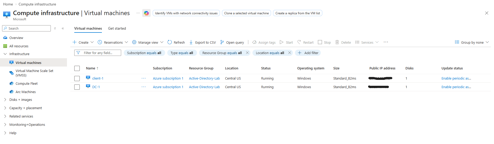
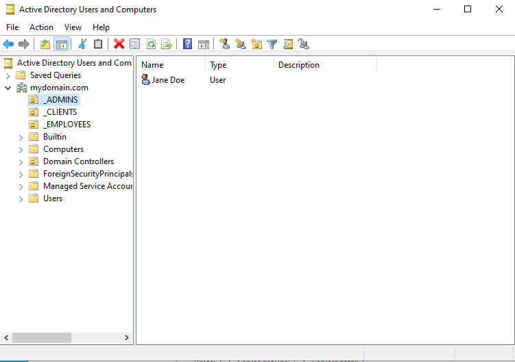
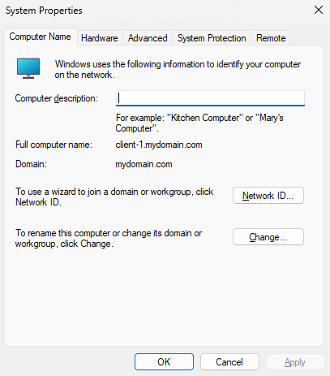
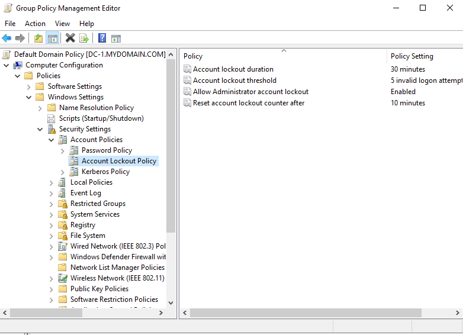

# Active Directory Domain Deployment in Azure

## 📌 Overview
In this lab, I built a basic enterprise-style network in Microsoft Azure.  
I deployed a Domain Controller and a client machine, configured Active Directory, and managed users, permissions, and security policies.

---

## 🛠️ Environment Setup
- Created a Resource Group in Azure
- Configured a Virtual Network and Subnet
- Deployed:
  - Windows Server 2022 VM (Domain Controller - DC-1)
  - Windows 10 VM (Client-1)
- Set DC-1 private IP to static
- Configured Client-1 DNS to point to DC-1

---

## 🧠 Active Directory Configuration
- Installed Active Directory Domain Services (AD DS)
- Promoted server to Domain Controller
- Created a new domain: `mydomain.com`

---

## 👤 User and Group Management
- Created Organizational Units:
  - _EMPLOYEES
  - _ADMINS
  - _CLIENTS
- Created users (ex: jane_admin)
- Added user to Domain Admins group

---

## 💻 Client Integration
- Joined Client-1 to the domain
- Verified domain login using created user

---

## 🔐 Security & Access Control
- Configured Group Policy:
  - Account lockout threshold: 5 attempts
  - Lockout duration: 30 minutes
- Enabled RDP access for domain users

---

## ⚙️ Automation
- Used PowerShell to bulk create users

---

## 🧪 Troubleshooting & Validation
- Verified DNS resolution
- Used `ipconfig /all` to confirm settings
- Tested domain login and lockout behavior

---

## 📸 Screenshots

### 🌐 Azure Virtual Machines

### 🧠 Active Directory Users & Groups

### 💻 Domain Join (Client-1)

### 🔐 Group Policy (Account Lockout)

---

## 🚀 Key Skills Demonstrated
- Active Directory setup and management
- Group Policy configuration
- Azure virtual networking
- Troubleshooting and validation

---

## 📌 Summary
This project demonstrates hands-on experience with deploying and managing a Windows domain environment in a cloud setting.
